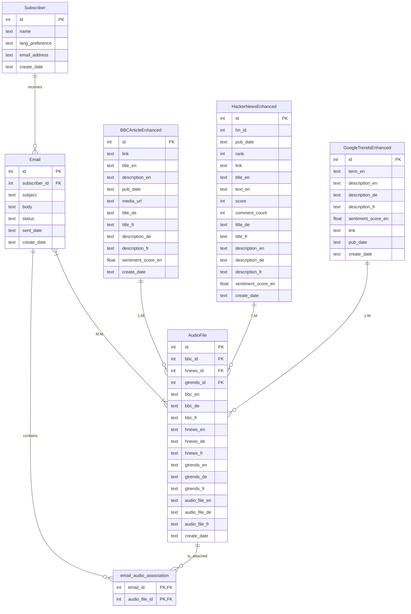

# Audioflow
The AudioFlow project is a fully automated news service that transforms text-based news into multilingual audio files and delivers them via email. It is designed for scalability and automation, making it a powerful tool for personalized news distribution.

### Container setup, which stems out of the docker compose file:

(a) Worker: `airflow_airflow-worker_1` (Where all the magic happens :)
- Runs DAG tasks in the Celery-queue.
- Executes the actual Python code inside DAGs.
- Logs output for task execution.

(b) Web UI & DAG Management: `airflow_airflow-webserver_1`
- Hosts the Airflow UI (accessible at http://your-server-ip:8080).
- Schedules DAG runs and serves the DAG dashboard.
- Does not execute DAG tasks but allows you to trigger them.

(c) DAG Scheduling: `airflow_airflow-scheduler_1`
- Schedules DAG runs and assigns tasks to workers.
- Ensures that DAGs run at the correct intervals.
- Moves DAG tasks to the Celery queue for execution.

(d) Other Containers:
- `airflow_postgres_1`: Airflow metadata database.
- `airflow_redis_1`: Celery backend (aka: message broker).
- `airflow_flower_1`: Celery monitoring UI (available at http://your-server-ip:5555).
- `airflow_airflow-init_1`: Used for initializing the Airflow database.

---

### Audioflow's ER Diagram

Note: 
- To view diagram within VSCODE, first install the extension called "Markdown Preview Mermaid Support" and right-click "Open Preview".
- Alternatively, browse to https://mermaid.live/ and paste in model's syntax in the live editor. 

#### (A) Relationships Explained

| Relationship | New Verb Used | Description |
|-------------|--------------|-------------|
| **Subscriber → Email** | `subscribes_to` | A **subscriber** subscribes to receive multiple emails. **(1:M)** |
| **Email → email_audio_association** | `includes` | An **email** includes multiple audio files via an association table. **(M:M via Junction Table)** |
| **AudioFile → email_audio_association** | `is_linked_to` | An **audio file** is linked to multiple emails via an association table. **(M:M via Junction Table)** |
| **Email → AudioFile** | `references` | An **email** references multiple audio files, forming an **M:M relationship**. |
| **BBCArticleEnhanced → AudioFile** | `is_converted_to` | A **BBC article** is converted into **one or more audio files**. **(1:M)** |
| **HackerNewsEnhanced → AudioFile** | `is_converted_to` | A **Hacker News article** is converted into **one or more audio files**. **(1:M)** |
| **GoogleTrendsEnhanced → AudioFile** | `is_converted_to` | A **Google Trends topic** is converted into **one or more audio files**. **(1:M)** |
*Note:  Subscriber {text email_address **UNIQUE**}*

---

#### (B) Diagram



---

### Credentials & Configs

#### (a) Create "keys"-folder and ".env"-file in root dir

You don't need any keys for the HackerNews or BBC News sources, but to access Google Trends data (via BigQuery), as well as Gemini (via Google Ai Studio) and Gmail SMTP, you need to set-up your: GENAI_API_KEY, BIGQUERY_PROJECT_ID, BIGQUERY_CREDENTIALS_PATH & SMTP_*. The gitignore-file already hides the above folder and file, so you can just set this up and add the details exactly like below. May the force be with you :)

#### (b) Google Trends (BIGQUERY_PROJECT_ID & BIGQUERY_CREDENTIALS_PATH)
Download your own unique "foobar-63738393030-t464474-62902egh.json"-file and add it under "keys"-folder.
- Step 1: Go to Google Cloud Console and select the project you want to use for BigQuery.
- Step 2: Create a Service Account
    - In the left sidebar, go to IAM & Admin → Service Accounts.
    - Click Create Service Account (at the top). 
    - Fill in:
        - Service Account Name: (e.g., bigquery-access)
        - Service Account ID: (automatically generated)
        - Description: (optional)
        - Click Create and Continue.
- Step 3: Assign Permissions
    - Under "Grant this service account access to the project", select:
        - BigQuery Admin (for full access) or BigQuery Data Viewer (for read-only access).
        - Click Continue.
- Step 4: Create & Download the JSON Key
    - Click Done (after setting permissions).
    - Find the newly created Service Account in the list.
    - Click on it to open the details.
    - Go to the Keys tab. Click "Add Key" → "Create New Key".
    - Select JSON format and click Create.
    - The JSON file will be automatically downloaded to your computer.
- Step 5: Move the File to: `/home/ubuntu/airflow/keys/foobar-63738393030-t464474-62902egh.json`

#### (c) GENAI_API_KEY: Google Ai Studio
To get an API key for Google AI Studio (Gemini API), follow these steps:
- Step 1: Go to Google AI Studio
    - Open Google AI Studio.
    - Sign in with your Google Account.
- Step 2: Generate an API Key
    - Click on your profile icon (top-right corner).
    - Select "API Keys" from the dropdown menu.
    - Click "Create API Key".
    - Copy the generated API key (you will need it for authentication).
- Step 3: Store the API Key Securely
    - Save it in a .env file.

#### (d) Email Gmail SMTP
- Step 1: Gmail requires "App Passwords" (not your normal password) for SMTP access.
    - Enable "Less Secure Apps" or App Passwords
    - Go to your Google Account Security page: [https://myaccount.google.com/security](https://myaccount.google.com/security)
    - Scroll to "How you sign in to Google" and enable:
        - For regular accounts: Enable 2-Step Verification, then generate an App Password.
        - For workspace accounts: You may need an admin to allow SMTP access.
    - Generate an App Password:
        - Click App Passwords.
        - Select Mail → Other → Name it something like "SMTP Access".
        - Click Generate and copy the password.
- Step 2: Configure Environment Variables
    - Edit your `.env` file:
    ```sh
    SMTP_SERVER="smtp.gmail.com"
    SMTP_PORT=587
    SMTP_USERNAME="your-email@gmail.com"
    SMTP_PASSWORD="your-app-password"  # Use the App Password from Step 1
    SMTP_SENDER_EMAIL="your-email@gmail.com"
    ```
- Step 3: Test sending an email with Python
    - Install `smtplib` if not already installed:
    ```sh
    pip install secure-smtplib
    ```
    - Use this Python script:
    ```python
    import smtplib
    import os

    SMTP_SERVER = os.getenv("SMTP_SERVER", "smtp.gmail.com")
    SMTP_PORT = int(os.getenv("SMTP_PORT", 587))
    SMTP_USERNAME = os.getenv("SMTP_USERNAME")
    SMTP_PASSWORD = os.getenv("SMTP_PASSWORD")
    SMTP_SENDER_EMAIL = os.getenv("SMTP_SENDER_EMAIL")
    TO_EMAIL = "foobarbar@example.com"

    subject = "Test Email from Python"
    body = "Hello, this is a test email from my Python script."

    message = f"Subject: {subject}\n\n{body}"

    try:
        with smtplib.SMTP(SMTP_SERVER, SMTP_PORT) as server:
            server.starttls()
            server.login(SMTP_USERNAME, SMTP_PASSWORD)
            server.sendmail(SMTP_SENDER_EMAIL, TO_EMAIL, message)
        print("Email sent successfully!")
    except Exception as e:
        print("Error:", e)
    ```
    - Replace `"foobarbar@example.com"` with your test email.
    - Run the script and check your inbox.

- Step 4: Additional Step: Update AIRFLOW__SMTP__SMTP_* in your docker-compose.yaml (Optional)
```yml
version: "3"
x-airflow-common: &airflow-common
  build: 
    context: .
    dockerfile: Dockerfile
  environment: &airflow-common-env
    # ...
    AIRFLOW__SMTP__SMTP_HOST: "smtp.gmail.com"
    AIRFLOW__SMTP__SMTP_PORT: 587
    AIRFLOW__SMTP__SMTP_USER: "foobarbar@gmail.com"
    AIRFLOW__SMTP__SMTP_PASSWORD: "foobarbar"
    AIRFLOW__SMTP__SMTP_MAIL_FROM: "foobarbar@gmail.com"
    # ...
```
*Note: You can also look at other services like [Mailtrap.io](https://mailtrap.io/) if you plan to onboard more subscribers.*

#### (e) If you have not already, add all the details to your ".env"-file:
```sh
# Environment:
APP_ENV=dev

# Data Extraction & Context Generation:
GENAI_API_KEY = "...."
BIGQUERY_PROJECT_ID="...."
BIGQUERY_CREDENTIALS_PATH="...."

# Scheduling:
AIRFLOW_UID=1000
AIRFLOW_GID=0

# Emailing:
SMTP_SERVER="smtp.gmail.com"
SMTP_PORT=587
SMTP_USERNAME="...."
SMTP_PASSWORD="...."
SMTP_SENDER_EMAIL="...."
```

*Note: It helped me to first test each end-point first individually, and then via the dags afterwards.*

---

### Bash Commands

#### Common Commands for Debugging: 
```sh
docker logs <container_name>
docker logs airflow_airflow-webserver_1

docker exec -it <container_name> /bin/bash
docker exec -it airflow_airflow-webserver_1 /bin/bash

docker exec -it <container_name> bash
docker exec -it airflow_airflow-webserver-1 bash
docker run -it airflow_airflow-worker_1 bash
docker run -it apache/airflow:latest-python3.9 bash

docker exec -it <container_name> ls -l /opt/airflow/data
docker exec -it airflow_airflow-worker_1 ls -l /opt/airflow/data

echo $BIGQUERY_CREDENTIALS_PATH
echo $_PIP_ADDITIONAL_REQUIREMENTS
```

#### After updating your docker-compose.yml, run:
```sh
ubuntu@ip-172-01-35-23:~/airflow $ docker-compose down
ubuntu@ip-172-01-35-23:~/airflow $ docker-compose up -d --build # -d flag: Run in the background.
ubuntu@ip-172-01-35-23:~/airflow $ docker-compose up --build --force-recreate 
```

#### Enter main/specific container:
```sh
ubuntu@ip-172-01-35-23:~/airflow $ docker exec -it airflow_airflow-worker_1 bash
default@3abc5e24ca4b:/opt/airflow$ 
default@3abc5e24ca4b:/opt/airflow$ python3 run.py
```

#### uvicorn app:app --reload
- Open your browser and navigate to either:
  - http://localhost:8000 to access the app.
  - http://{public_ip}:8000 (e.g. http://52.113.52.270:8000/)
- Interactive API documentation is provided here: http://localhost:8000/docs (or http://localhost:8000/openapi.json).
```sh
default@3abc5e24ca4b:/opt/airflow$ python3 app/database.py
default@3abc5e24ca4b:/opt/airflow$ python utils/mockdata.py
```
---

### SQL Bash Commands

#### Verify the tables exist: subscribers, emails, email_audio_association, etc...
```sh
default@3abc5e24ca4b:/opt/airflow$ sqlite3 data/dev/data_dev.db ".tables" 
default@3abc5e24ca4b:/opt/airflow$ sqlite3 data/dev/data_dev.db ".schema bbc_articles_enhanced"
```

#### list all the attached databases to ensure querying the right one:
```sh
default@3abc5e24ca4b:/opt/airflow$ sqlite3 data/dev/data_dev.db "PRAGMA database_list;" # 0|main|/opt/airflow/data/dev/data_dev.db
```

#### Ensure above dir is correctly mounted in docker compose. You can only access above folder/file/db on vscode, if it is mounted in docker-compose file.
```sh
volumes:
  - ./data:/opt/airflow/data
```

##### ALL TABLES
```sh
sqlite3 data/dev/data_dev.db "SELECT name FROM sqlite_master WHERE type='table';"
# Consider also naming in sqlite queries below ....
# data/dev/data_dev.db
# data/prod/data_prod.db
# data/mock/data_mock.db
```

##### BBC NEWS TABLE
```sh
sqlite3 data/dev/data_dev.db ".schema bbc_articles_enhanced"
sqlite3 data/dev/data_dev.db "SELECT COUNT(*) FROM bbc_articles_enhanced;"
sqlite3 data/dev/data_dev.db "SELECT link, COUNT(*) FROM bbc_articles_enhanced GROUP BY link HAVING COUNT(*) > 1;"
sqlite3 data/dev/data_dev.db "SELECT * FROM bbc_articles_enhanced;"
sqlite3 data/dev/data_dev.db "SELECT * FROM bbc_articles_enhanced ORDER BY create_date DESC LIMIT 10;"
sqlite3 -header -csv data/dev/data_dev.db "SELECT * FROM bbc_articles_enhanced;" > data/bbc_articles_enhanced.csv
sqlite3 -header -csv data/dev/data_dev.db "SELECT * FROM bbc_articles_enhanced LIMIT 15;" > data/bbc_articles_enhanced.csv
🟢🟢🟢🟢🟢🟢🟢🟢🟢🟢🟢🟢🟢🟢🟢🟢🟢🟢🟢🟢🟢🟢🟢🟢🟢🟢🟢🟢🟢🟢🟢🟢🟢🟢🟢🟢🟢🟢🟢🟢🟢🟢🟢🟢🟢🟢🟢🟢🟢🟢🟢🟢🟢🟢🟢🟢🟢🟢🟢
🔴🔴🔴🔴🔴🔴🔴🔴🔴🔴🔴🔴🔴🔴🔴🔴🔴🔴🔴🔴🔴🔴🔴🔴🔴🔴🔴🔴🔴🔴🔴🔴🔴🔴🔴🔴🔴🔴🔴🔴🔴🔴🔴🔴🔴🔴🔴🔴🔴🔴🔴🔴🔴🔴🔴🔴🔴🔴🔴 
sqlite3 data/dev/data_dev.db "DELETE FROM bbc_articles_enhanced;"
sqlite3 data/dev/data_dev.db "DROP TABLE bbc_articles_enhanced;"
```

##### Hackernews TABLE
```sh
sqlite3 data/dev/data_dev.db ".schema hnews_articles_enhanced"
sqlite3 data/dev/data_dev.db "SELECT COUNT(*) FROM hnews_articles_enhanced;"
sqlite3 data/dev/data_dev.db "SELECT hn_id, COUNT(*) FROM hnews_articles_enhanced GROUP BY hn_id HAVING COUNT(*) > 1;"
sqlite3 data/dev/data_dev.db "SELECT * FROM hnews_articles_enhanced;"
sqlite3 data/dev/data_dev.db "SELECT * FROM hnews_articles_enhanced ORDER BY create_date DESC LIMIT 10;"
sqlite3 -header -csv data/dev/data_dev.db "SELECT * FROM hnews_articles_enhanced;" > data/hnews_articles_enhanced.csv
sqlite3 -header -csv data/dev/data_dev.db "SELECT * FROM hnews_articles_enhanced LIMIT 15;" > data/hnews_articles_enhanced.csv
🟢🟢🟢🟢🟢🟢🟢🟢🟢🟢🟢🟢🟢🟢🟢🟢🟢🟢🟢🟢🟢🟢🟢🟢🟢🟢🟢🟢🟢🟢🟢🟢🟢🟢🟢🟢🟢🟢🟢🟢🟢🟢🟢🟢🟢🟢🟢🟢🟢🟢🟢🟢🟢🟢🟢🟢🟢🟢🟢
🔴🔴🔴🔴🔴🔴🔴🔴🔴🔴🔴🔴🔴🔴🔴🔴🔴🔴🔴🔴🔴🔴🔴🔴🔴🔴🔴🔴🔴🔴🔴🔴🔴🔴🔴🔴🔴🔴🔴🔴🔴🔴🔴🔴🔴🔴🔴🔴🔴🔴🔴🔴🔴🔴🔴🔴🔴🔴🔴  
sqlite3 data/dev/data_dev.db "DELETE FROM hnews_articles_enhanced;"
sqlite3 data/dev/data_dev.db "DROP TABLE hnews_articles_enhanced;"
```

##### GTrends TABLE
```sh
sqlite3 data/dev/data_dev.db ".schema gtrends_terms_enhanced"
sqlite3 data/dev/data_dev.db "SELECT COUNT(*) FROM gtrends_terms_enhanced;"
sqlite3 data/dev/data_dev.db "SELECT term_en, COUNT(*) FROM gtrends_terms_enhanced GROUP BY term_en HAVING COUNT(*) > 1;"
sqlite3 data/dev/data_dev.db "SELECT * FROM gtrends_terms_enhanced;"
sqlite3 data/dev/data_dev.db "SELECT * FROM gtrends_terms_enhanced ORDER BY create_date DESC LIMIT 10;"
sqlite3 -header -csv data/dev/data_dev.db "SELECT * FROM gtrends_terms_enhanced;" > data/gtrends_terms_enhanced.csv
sqlite3 -header -csv data/dev/data_dev.db "SELECT * FROM gtrends_terms_enhanced LIMIT 15;" > data/gtrends_terms_enhanced.csv
🟢🟢🟢🟢🟢🟢🟢🟢🟢🟢🟢🟢🟢🟢🟢🟢🟢🟢🟢🟢🟢🟢🟢🟢🟢🟢🟢🟢🟢🟢🟢🟢🟢🟢🟢🟢🟢🟢🟢🟢🟢🟢🟢🟢🟢🟢🟢🟢🟢🟢🟢🟢🟢🟢🟢🟢🟢🟢🟢
🔴🔴🔴🔴🔴🔴🔴🔴🔴🔴🔴🔴🔴🔴🔴🔴🔴🔴🔴🔴🔴🔴🔴🔴🔴🔴🔴🔴🔴🔴🔴🔴🔴🔴🔴🔴🔴🔴🔴🔴🔴🔴🔴🔴🔴🔴🔴🔴🔴🔴🔴🔴🔴🔴🔴🔴🔴🔴🔴  
sqlite3 data/dev/data_dev.db "DELETE FROM gtrends_terms_enhanced;"
sqlite3 data/dev/data_dev.db "DROP TABLE gtrends_terms_enhanced;"
```

##### AudioFiles TABLE
```sh
sqlite3 data/dev/data_dev.db ".schema audio_files"
sqlite3 data/dev/data_dev.db "SELECT COUNT(*) FROM audio_files;"
sqlite3 data/dev/data_dev.db "SELECT * FROM audio_files LIMIT 10;"
sqlite3 data/dev/data_dev.db "SELECT * FROM audio_files ORDER BY create_date DESC LIMIT 10;"
sqlite3 -header -csv data/dev/data_dev.db "SELECT * FROM audio_files;" > data/audio_files.csv
sqlite3 -header -csv data/dev/data_dev.db "SELECT * FROM audio_files LIMIT 15;" > data/audio_files.csv
🟢🟢🟢🟢🟢🟢🟢🟢🟢🟢🟢🟢🟢🟢🟢🟢🟢🟢🟢🟢🟢🟢🟢🟢🟢🟢🟢🟢🟢🟢🟢🟢🟢🟢🟢🟢🟢🟢🟢🟢🟢🟢🟢🟢🟢🟢🟢🟢🟢🟢🟢🟢🟢🟢🟢🟢🟢🟢🟢
🔴🔴🔴🔴🔴🔴🔴🔴🔴🔴🔴🔴🔴🔴🔴🔴🔴🔴🔴🔴🔴🔴🔴🔴🔴🔴🔴🔴🔴🔴🔴🔴🔴🔴🔴🔴🔴🔴🔴🔴🔴🔴🔴🔴🔴🔴🔴🔴🔴🔴🔴🔴🔴🔴🔴🔴🔴🔴🔴  
sqlite3 data/dev/data_dev.db "DELETE FROM audio_files;"
sqlite3 data/dev/data_dev.db "DROP TABLE audio_files;"
```

##### Emails TABLE
```sh
sqlite3 data/dev/data_dev.db ".schema emails"
sqlite3 data/dev/data_dev.db "SELECT COUNT(*) FROM emails;"
sqlite3 data/dev/data_dev.db "SELECT * FROM emails;"
sqlite3 data/dev/data_dev.db "SELECT * FROM emails ORDER BY create_date DESC LIMIT 10;"
sqlite3 -header -csv data/dev/data_dev.db "SELECT * FROM emails;" > data/emails.csv
sqlite3 -header -csv data/dev/data_dev.db "SELECT * FROM emails LIMIT 15;" > data/emails.csv
🟢🟢🟢🟢🟢🟢🟢🟢🟢🟢🟢🟢🟢🟢🟢🟢🟢🟢🟢🟢🟢🟢🟢🟢🟢🟢🟢🟢🟢🟢🟢🟢🟢🟢🟢🟢🟢🟢🟢🟢🟢🟢🟢🟢🟢🟢🟢🟢🟢🟢🟢🟢🟢🟢🟢🟢🟢🟢🟢
🔴🔴🔴🔴🔴🔴🔴🔴🔴🔴🔴🔴🔴🔴🔴🔴🔴🔴🔴🔴🔴🔴🔴🔴🔴🔴🔴🔴🔴🔴🔴🔴🔴🔴🔴🔴🔴🔴🔴🔴🔴🔴🔴🔴🔴🔴🔴🔴🔴🔴🔴🔴🔴🔴🔴🔴🔴🔴🔴  
sqlite3 data/dev/data_dev.db "DELETE FROM emails;"
sqlite3 data/dev/data_dev.db "DROP TABLE emails;"
# sqlite3 data/dev/data_dev.db <<EOF PRAGMA foreign_keys=off; DROP TABLE emails; PRAGMA foreign_keys=on; .exit EOF
```

##### Subscribers TABLE
```sh
sqlite3 data/dev/data_dev.db ".schema subscribers"
sqlite3 data/dev/data_dev.db "SELECT COUNT(*) FROM subscribers;"
sqlite3 data/dev/data_dev.db "SELECT * FROM subscribers;"
sqlite3 data/dev/data_dev.db "SELECT * FROM subscribers ORDER BY create_date DESC LIMIT 10;"
sqlite3 -header -csv data/dev/data_dev.db "SELECT * FROM subscribers;" > data/subscribers.csv
sqlite3 -header -csv data/dev/data_dev.db "SELECT * FROM subscribers LIMIT 10;" > data/subscribers.csv
🟢🟢🟢🟢🟢🟢🟢🟢🟢🟢🟢🟢🟢🟢🟢🟢🟢🟢🟢🟢🟢🟢🟢🟢🟢🟢🟢🟢🟢🟢🟢🟢🟢🟢🟢🟢🟢🟢🟢🟢🟢🟢🟢🟢🟢🟢🟢🟢🟢🟢🟢🟢🟢🟢🟢🟢🟢🟢🟢
🔴🔴🔴🔴🔴🔴🔴🔴🔴🔴🔴🔴🔴🔴🔴🔴🔴🔴🔴🔴🔴🔴🔴🔴🔴🔴🔴🔴🔴🔴🔴🔴🔴🔴🔴🔴🔴🔴🔴🔴🔴🔴🔴🔴🔴🔴🔴🔴🔴🔴🔴🔴🔴🔴🔴🔴🔴🔴🔴  
sqlite3 data/dev/data_dev.db "DELETE FROM subscribers;"
sqlite3 data/dev/data_dev.db "DROP TABLE subscribers;"
```